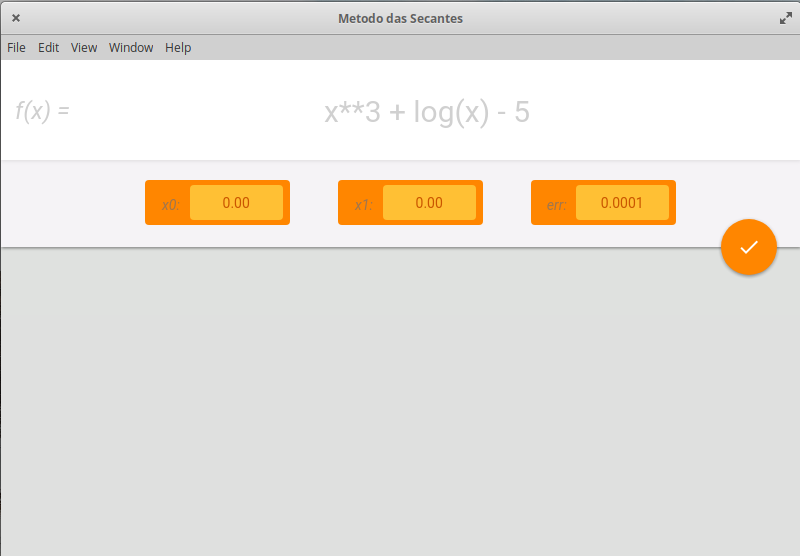

# Secant Method Calculator

A electron app that calculate and plot equations solvable by the secant mathematical method!

This software was developed as a final task in the numerical calculus class, at UTFPR-md computer science course!!

## Screenshots

## Build With

- Python;
- Electron.js.
